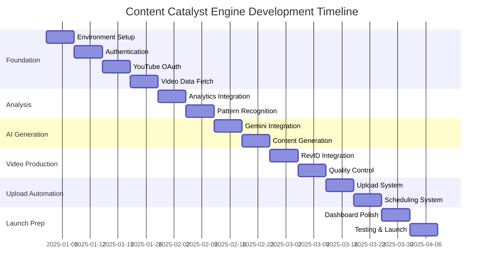

# Content Catalyst Engine - Timeline and Milestones

## Project Overview and Timeline

### Project Duration: 14 Weeks (3.5 Months)
**Start Date**: Week 1  
**Target Launch Date**: Week 14  
**Post-Launch Stabilization**: Weeks 15-16

### Development Methodology
The project follows an Agile development approach with 2-week sprints, allowing for iterative development, continuous feedback, and adaptive planning. Each phase contains multiple sprints with specific deliverables and acceptance criteria.

## Phase 1: Foundation Setup (Weeks 1-4)

### Sprint 1: Project Initialization (Weeks 1-2)

#### Week 1: Environment Setup and Architecture
**Sprint Goal**: Establish development environment and technical foundation

**Key Deliverables**:
- [ ] **TASK**: Set up development environment with Node.js 18+, Next.js 14, and TypeScript
- [ ] **TASK**: Initialize Supabase project with PostgreSQL database
- [ ] **TASK**: Configure Vercel deployment pipeline with staging environment
- [ ] **TASK**: Set up GitHub repository with branch protection and CI/CD workflows
- [ ] **TASK**: Create initial project structure and development documentation

**Acceptance Criteria**:
- Development environment fully functional for all team members
- Database schema design approved and initial tables created
- CI/CD pipeline successfully deploys to staging environment
- Code quality tools (ESLint, Prettier, TypeScript) properly configured

**Risk Mitigation**:
- Daily standup meetings to identify and resolve setup issues quickly
- Pair programming sessions for knowledge sharing
- Backup development environment using Docker containers

#### Week 2: Core Infrastructure and Authentication

**Key Deliverables**:
- [ ] **TASK**: Implement user authentication system with Supabase Auth
- [ ] **TASK**: Create user registration and login interfaces
- [ ] **TASK**: Set up database schema with RLS policies
- [ ] **TASK**: Implement basic dashboard layout and navigation
- [ ] **TASK**: Configure security headers and CORS policies

**Acceptance Criteria**:
- Users can register, login, and logout successfully
- Dashboard displays authenticated user information
- Database security policies prevent unauthorized data access
- Basic responsive design works on desktop and mobile

### Sprint 2: YouTube Integration Foundation (Weeks 3-4)

#### Week 3: YouTube OAuth Integration

**Key Deliverables**:
- [ ] **TASK**: Implement YouTube OAuth 2.0 authentication flow
- [ ] **TASK**: Create YouTube channel connection interface
- [ ] **TASK**: Set up YouTube API client with proper error handling
- [ ] **TASK**: Store and manage YouTube access tokens securely
- [ ] **TASK**: Implement token refresh mechanism

**Acceptance Criteria**:
- Users can connect their YouTube channels through OAuth
- YouTube tokens are stored encrypted in the database
- Token refresh works automatically before expiration
- Error messages are user-friendly and actionable

#### Week 4: Basic Video Data Retrieval

**Key Deliverables**:
- [ ] **TASK**: Implement YouTube channel video fetching
- [ ] **TASK**: Create video data processing and storage system
- [ ] **TASK**: Build basic video list interface in dashboard
- [ ] **TASK**: Implement YouTube API quota monitoring
- [ ] **TASK**: Add basic error handling and retry logic

**Acceptance Criteria**:
- System can fetch and display user's YouTube videos
- Video metadata is properly stored and indexed
- API quota usage is tracked and monitored
- Users receive feedback during video synchronization

**Phase 1 Milestone Review**:
- Technical foundation is solid and scalable
- User authentication and YouTube integration working
- Development team velocity is stable
- Code quality metrics meet established standards

## Phase 2: Content Analysis Engine (Weeks 5-6)

### Sprint 3: Performance Analysis Implementation (Weeks 5-6)

#### Week 5: Analytics Data Integration

**Key Deliverables**:
- [ ] **TASK**: Implement YouTube Analytics API integration
- [ ] **TASK**: Create performance scoring algorithm
- [ ] **TASK**: Build video performance calculation functions
- [ ] **TASK**: Design analytics data visualization components
- [ ] **TASK**: Implement caching layer for analytics data

**Acceptance Criteria**:
- System retrieves comprehensive analytics for user videos
- Performance scores are calculated accurately and consistently
- Analytics data is cached appropriately to minimize API calls
- Performance trends are visualized clearly in the dashboard

#### Week 6: Content Pattern Recognition

**Key Deliverables**:
- [ ] **TASK**: Implement content analysis algorithms
- [ ] **TASK**: Create top-performing video identification system
- [ ] **TASK**: Build insights generation engine
- [ ] **TASK**: Design content insights dashboard interface
- [ ] **TASK**: Add export functionality for analysis results

**Acceptance Criteria**:
- System identifies top 10 performing videos from last 30 days
- Content patterns and insights are generated automatically
- Insights are presented in an actionable format
- Users can export analysis results for external use

**Phase 2 Milestone Review**:
- Content analysis engine produces accurate insights
- Performance scoring algorithm is validated with real data
- Analytics dashboard provides valuable user insights
- API integration is stable and efficient

## Phase 3: AI Content Generation (Weeks 7-8)

### Sprint 4: Gemini AI Integration (Weeks 7-8)

#### Week 7: AI Service Integration

**Key Deliverables**:
- [ ] **TASK**: Integrate Google Gemini 2.5 Pro API
- [ ] **TASK**: Create content generation prompt templates
- [ ] **TASK**: Implement AI content generation service
- [ ] **TASK**: Build content quality scoring system
- [ ] **TASK**: Add content filtering and safety checks

**Acceptance Criteria**:
- Gemini API integration is stable and secure
- Generated content meets quality standards consistently
- Safety filters prevent inappropriate content generation
- Generation costs are tracked and optimized

#### Week 8: Title and Script Generation

**Key Deliverables**:
- [ ] **TASK**: Implement video title generation based on performance analysis
- [ ] **TASK**: Create Dutch language script generation system
- [ ] **TASK**: Build content approval workflow interface
- [ ] **TASK**: Implement content editing and regeneration features
- [ ] **TASK**: Add content history and version management

**Acceptance Criteria**:
- System generates 5-10 relevant title suggestions
- Dutch scripts are motivational and properly structured
- Users can easily approve, edit, or regenerate content
- Content generation history is maintained for reference

**Phase 3 Milestone Review**:
- AI integration produces high-quality, relevant content
- Dutch language generation meets native speaker standards
- Content approval workflow is intuitive and efficient
- Generation costs remain within budget projections

## Phase 4: Video Production Pipeline (Weeks 9-10)

### Sprint 5: RevID Integration (Weeks 9-10)

#### Week 9: Video Generation Service

**Key Deliverables**:
- [ ] **TASK**: Integrate RevID API for video generation
- [ ] **TASK**: Implement script formatting for RevID requirements
- [ ] **TASK**: Create video generation job queue system
- [ ] **TASK**: Build video generation status monitoring
- [ ] **TASK**: Add video preview and download functionality

**Acceptance Criteria**:
- RevID integration generates high-quality 9:16 videos
- Video generation jobs are queued and processed efficiently
- Users receive real-time updates on generation progress
- Generated videos can be previewed before upload

#### Week 10: Video Processing and Quality Control

**Key Deliverables**:
- [ ] **TASK**: Implement video quality validation system
- [ ] **TASK**: Create video regeneration and retry mechanisms
- [ ] **TASK**: Build video editing and customization options
- [ ] **TASK**: Add video thumbnail generation and selection
- [ ] **TASK**: Implement video file management and storage

**Acceptance Criteria**:
- Video quality meets platform standards consistently
- Failed generations are automatically retried or flagged
- Users can make basic customizations to generated videos
- Video files are efficiently stored and managed

**Phase 4 Milestone Review**:
- Video generation pipeline is reliable and scalable
- Generated video quality meets user expectations
- Processing times are within acceptable ranges
- Error handling and recovery mechanisms work effectively

## Phase 5: Upload Automation (Weeks 11-12)

### Sprint 6: YouTube Upload System (Weeks 11-12)

#### Week 11: SEO Content Generation and Upload Implementation

**Key Deliverables**:
- [ ] **TASK**: Implement SEO-optimized description generation
- [ ] **TASK**: Create YouTube tags generation system
- [ ] **TASK**: Build YouTube video upload functionality
- [ ] **TASK**: Implement upload progress monitoring
- [ ] **TASK**: Add upload error handling and retry logic

**Acceptance Criteria**:
- Generated descriptions are 150+ words and SEO-optimized
- Tags are relevant and within YouTube's 500-character limit
- Videos upload successfully with all metadata
- Upload progress is visible to users in real-time

#### Week 12: Scheduling and Automation

**Key Deliverables**:
- [ ] **TASK**: Create video scheduling system with queue management
- [ ] **TASK**: Implement automated daily upload scheduling
- [ ] **TASK**: Build content calendar interface
- [ ] **TASK**: Add upload confirmation and success tracking
- [ ] **TASK**: Implement bulk operations for multiple videos

**Acceptance Criteria**:
- Videos are scheduled and uploaded automatically at specified times
- Content calendar shows all scheduled and published content
- Users receive notifications upon successful uploads
- Bulk operations work efficiently for multiple videos

**Phase 5 Milestone Review**:
- Upload automation works reliably for scheduled content
- SEO content generation improves video discoverability
- Scheduling system handles timezone and frequency requirements
- Upload success rate exceeds 95%

## Phase 6: Dashboard and User Experience (Weeks 13-14)

### Sprint 7: Dashboard Enhancement and Polish (Weeks 13-14)

#### Week 13: Advanced Dashboard Features

**Key Deliverables**:
- [ ] **TASK**: Implement real-time dashboard updates
- [ ] **TASK**: Create comprehensive analytics visualizations
- [ ] **TASK**: Build activity feed and notification system
- [ ] **TASK**: Add user preferences and settings management
- [ ] **TASK**: Implement export and reporting functionality

**Acceptance Criteria**:
- Dashboard updates in real-time without page refresh
- Analytics provide actionable insights and trends
- Notifications keep users informed of important events
- User can customize their experience and preferences

#### Week 14: Final Testing and Launch Preparation

**Key Deliverables**:
- [ ] **TASK**: Complete end-to-end testing of all workflows
- [ ] **TASK**: Perform security audit and penetration testing
- [ ] **TASK**: Optimize performance and fix any bottlenecks
- [ ] **TASK**: Complete user documentation and help system
- [ ] **TASK**: Prepare production deployment and monitoring

**Acceptance Criteria**:
- All user workflows complete successfully in testing
- Security vulnerabilities are identified and resolved
- Application performance meets defined benchmarks
- Documentation is comprehensive and user-friendly

**Phase 6 Milestone Review**:
- Application is production-ready and fully tested
- User experience is polished and intuitive
- Documentation and support materials are complete
- Launch readiness checklist is 100% complete

## Critical Path and Dependencies

### Critical Path Analysis


### Key Dependencies
1. **YouTube API Access**: Must be approved and tested before Week 3
2. **Gemini API Access**: Required for Week 7 AI integration
3. **RevID API Partnership**: Essential for Week 9 video generation
4. **Supabase Database**: Core dependency for all data operations
5. **Vercel Deployment**: Required for staging and production environments

### Risk Timeline
- **Week 2**: API integration complexity may cause delays
- **Week 6**: Performance algorithm accuracy validation
- **Week 8**: AI content quality may require iteration
- **Week 10**: Video generation performance optimization
- **Week 12**: Upload automation reliability testing
- **Week 14**: Final integration testing and bug fixes

## Resource Allocation and Team Structure

### Core Development Team
- **1 Tech Lead/Full-Stack Developer**: Overall architecture and critical implementations
- **1 Frontend Developer**: UI/UX implementation and user experience
- **1 Backend Developer**: API integrations and database optimization
- **1 AI/Integration Specialist**: External API integrations and AI prompt engineering
- **1 QA Engineer**: Testing automation and quality assurance

### Development Effort Distribution
```
Phase 1 (Foundation): 25% of total effort
Phase 2 (Analysis): 15% of total effort  
Phase 3 (AI Generation): 20% of total effort
Phase 4 (Video Production): 20% of total effort
Phase 5 (Upload Automation): 15% of total effort
Phase 6 (Dashboard/Polish): 5% of total effort
```

### Weekly Effort Allocation
- **Development**: 70% of team capacity
- **Testing**: 20% of team capacity
- **Documentation**: 5% of team capacity
- **Planning/Meetings**: 5% of team capacity

## Quality Gates and Checkpoints

### Sprint Quality Gates
Each sprint must meet the following criteria before proceeding:
1. **Functionality**: All acceptance criteria met
2. **Code Quality**: 90%+ test coverage, linting passes
3. **Performance**: Response times within defined limits
4. **Security**: Security review completed for new features
5. **Documentation**: Technical and user documentation updated

### Phase Quality Gates
1. **Phase 1**: Foundation stability and authentication security
2. **Phase 2**: Analytics accuracy and performance validation
3. **Phase 3**: AI content quality and safety validation
4. **Phase 4**: Video generation reliability and quality
5. **Phase 5**: Upload automation success rate >95%
6. **Phase 6**: End-to-end workflow completion and user acceptance

### Go/No-Go Decision Points

#### Week 4 Checkpoint: Foundation Review
**Criteria for Proceeding**:
- Authentication system fully functional and secure
- YouTube API integration stable and tested
- Database performance meets requirements
- Development velocity on track

**Escalation**: If criteria not met, extend Phase 1 by 1 week

#### Week 8 Checkpoint: AI Integration Review
**Criteria for Proceeding**:
- Content generation quality meets standards
- AI API costs within budget projections
- Content approval workflow user-tested
- Generation speed meets user expectations

**Escalation**: If criteria not met, consider alternative AI providers

#### Week 12 Checkpoint: Pre-Launch Review
**Criteria for Proceeding**:
- End-to-end workflow tested successfully
- Performance benchmarks achieved
- Security audit completed with no critical issues
- User acceptance testing passed

**Escalation**: If criteria not met, delay launch and address issues

## Post-Launch Timeline (Weeks 15-18)

### Week 15-16: Launch Stabilization
- [ ] **TASK**: Monitor system performance and stability
- [ ] **TASK**: Address any critical issues or bugs
- [ ] **TASK**: Collect and analyze user feedback
- [ ] **TASK**: Optimize performance based on real usage patterns
- [ ] **TASK**: Scale infrastructure based on user adoption

### Week 17-18: Enhancement Planning
- [ ] **TASK**: Analyze user behavior and feature usage
- [ ] **TASK**: Plan first post-launch feature release
- [ ] **TASK**: Develop customer success and support processes
- [ ] **TASK**: Create marketing and user acquisition strategies
- [ ] **TASK**: Begin planning for mobile application development

## Success Metrics and KPIs

### Technical KPIs
- **System Uptime**: >99.5%
- **API Response Time**: <500ms average
- **Video Generation Success Rate**: >95%
- **Upload Success Rate**: >98%
- **Error Rate**: <1% of all operations

### User Experience KPIs
- **User Onboarding Completion**: >80%
- **Feature Adoption Rate**: >70% for core features
- **User Satisfaction Score**: >4.5/5.0
- **Support Ticket Volume**: <5% of active users
- **User Retention (30-day)**: >60%

### Business KPIs
- **Time to First Video Generated**: <10 minutes
- **Average Videos Generated per User**: >3/month
- **Content Quality Score**: >8/10 user rating
- **API Cost per Video**: <€0.50
- **Customer Acquisition Cost**: <€25

## Timeline Risks and Mitigation

### High-Risk Items
1. **External API Dependencies**: Mitigation through early integration and backup plans
2. **AI Content Quality**: Continuous testing and prompt optimization
3. **Video Generation Performance**: Load testing and optimization cycles
4. **User Experience Complexity**: Regular user testing and feedback incorporation

### Schedule Buffer Management
- **Built-in Buffer**: 10% schedule buffer in each phase
- **Critical Path Protection**: 20% buffer for critical path items
- **Resource Flexibility**: Ability to reallocate resources between parallel tasks
- **Scope Management**: Pre-defined feature priorities for scope adjustments

### Contingency Plans
- **Feature Reduction**: Prioritized feature list for scope reduction if needed
- **Timeline Extension**: Pre-approved extension scenarios and criteria
- **Resource Augmentation**: External contractor availability for critical needs
- **Alternative Solutions**: Backup approaches for high-risk technical components

**[ ] TASK**: Establish project management tools and tracking systems
**[ ] TASK**: Set up automated milestone and deadline monitoring
**[ ] TASK**: Create detailed task breakdown and resource allocation
**[ ] TASK**: Implement risk tracking and mitigation monitoring
**[ ] TASK**: Design project dashboard for stakeholder visibility